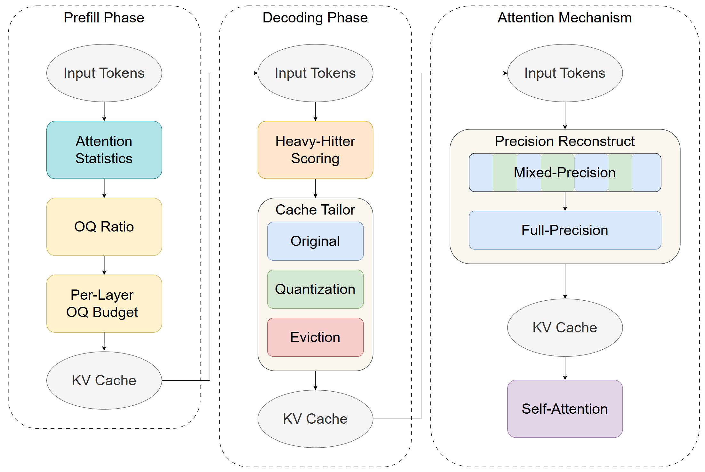

# AKCB: Adaptive and Resource-Efficient KV Cache Management under Limited Memory Budget for Long-Context Inference in LLMs

The high-level overview of the AKCB framework is as follows:


AKCB consists of three key components: (1) Per-layer Original Quantization (OQ) ratio estimation to determine each layer’s compression sensitivity, (2) Token importance scoring based on online attention statistics, and (3) Tri-state cache assignment to fit a memory budget via selective precision control. 

* Prefill phase: Each layer’s Origin budget is determined by an OQ score combining entropy, variance, and kurtosis of attention distributions. These scores are normalized into an OQ ratio, ensuring the limited cache budget is fairly distributed across layers.
* Decoding phase: At each step, hh scores are computed only on the evictable region $[0 : K − W)$. A keep set is selected, then divided into Original and Quantization according to the budget, with the remainder evicted. The most recent W , the window protection region, tokens are always retained in Original.
* Reconstruction Before Attention: Quantized entries are dequantized on-the-fly using per-token scales and merged with Original entries in their original sequence order. This guarantees a logically contiguous KV cache for attention.

# Abstract

Large Language Models (LLMs) are increasingly deployed in scenarios demanding ultra-long context reasoning, such as agentic workflows and deep research understanding. However, long-context inference is constrained by the KV cache, a transient memory structure that grows linearly with sequence length and batch size, quickly dominating GPU memory usage. Existing memory reduction techniques, including eviction and quantization, often rely on static heuristics and suffer from degraded quality under tight budgets. In this paper, we propose AKCB, a lightweight and adaptive framework that dynamically allocates precision levels to cached tokens based on per-layer attention dynamics and token-level importance. During a short prefill phase, AKCB estimates the original quantization (OQ) ratio of each layer by computing statistical scores such as attention entropy, variance and kurtosis. During decoding, tokens are assigned to one of three states—Original (full precision), Quantization (low precision), or Eviction—according to a fast heavy-hitter scoring strategy. Our experiments on LLaMA3 and Qwen3 models across diverse long- and short-context tasks demonstrate that AKCB preserves $\sim$97\% of baseline accuracy on long-context benchmarks while reducing KV memory usage by 4$\times$, with minimal throughput loss. On short-context tasks, AKCB matches full-precision baselines; on GSM8K math reasoning, it significantly outperforms uniform quantization. These results highlight the practical viability of AKCB for scalable LLM deployment, offering fine-grained, data-driven memory control without retraining or architectural modifications.

# Dependencies

> Notion：The dependencies come from `pyproject.toml` and `environment.yml`. Where `>=` means the minimum required version; the exact version installed in your environment may be higher.

| Name | Version | Purpose |
|------|---------|---------|
| `python` | `3.10` | Runtime |
| `pytorch` (`torch`) | `>=2.0.0` | Core deep learning framework |
| `pytorch-cuda` | `11.8` | CUDA runtime for PyTorch (conda) |
| `cudatoolkit` | `11.8` | CUDA toolkit (conda) |
| `transformers` | `>=4.35.0` | HuggingFace Transformers integration |
| `datasets` | `>=2.14.0` | Benchmark / dataset loading |
| `accelerate` | `>=0.24.0` | Multi-device / inference utilities |
| `tokenizers` | `>=0.14.0` | Fast tokenization backend |
| `numpy` | `>=1.24.0` | Numerical computing |
| `tqdm` | (un-pinned) | Progress bars |
| `sentencepiece` | `>=0.1.99` | Tokenizer model support |
| `protobuf` | `>=3.20.0` | Serialization dependency (Transformers ecosystem) |
| `lm-eval` | `>=0.4.0` | (Optional, `.[eval]`) evaluation harness |
| `rouge` | `>=1.0.1` | (Optional, `.[eval]`) ROUGE metric |
| `jieba` | `>=0.42.1` | (Optional, `.[eval]`) Chinese tokenization (some eval pipelines) |
| `fuzzywuzzy` | `>=0.18.0` | (Optional, `.[eval]`) fuzzy string matching |
| `python-Levenshtein` | `>=0.21.0` | (Optional, `.[eval]`) fast edit distance |
| `flash-attn` | `>=2.3.0` | (Optional, `.[flash]`) FlashAttention acceleration |
| `bitsandbytes` | `>=0.41.0` | (Optional, `.[quant]`) quantization backend |
| `pytest` | `>=8.0.0` | (Optional, `.[dev]`) testing |
| `black` | `>=23.0.0` | (Optional, `.[dev]`) formatting |
| `isort` | `>=5.12.0` | (Optional, `.[dev]`) import sorting |
| `flake8` | `>=6.0.0` | (Optional, `.[dev]`) linting |

# Repository Structure

This repository is organized around the AKCB runtime pipeline (config → attention patching → prefill scoring → decoding compression).

```text
AKCB/
  akcb/
    cache/
      adaptive_cache.py
      origin_cache.py
      window_cache.py
      quant_cache.py
      mix_cache.py
    model/
      modle_llama.py
      modify_qwen3.py
    calculator.py
    config.py
```

## Core package: `akcb/`

- `akcb/config.py`
	- Defines `ADCacheConfig`, the central runtime configuration (cache size, window size, `tau1/tau2/tau3`, `gamma`, cache type).
	- Initializes per-layer state such as `prefill` flags and `decoding_compressor` handles.

- `akcb/calculator.py`
	- Prefill-time statistics used to estimate layer sensitivity / OQ preference (entropy, variance, kurtosis).
	- Decoding-time token importance utilities such as heavy-hitter scoring.

- `akcb/cache/`
	- Cache implementations and compressors.
	- `adaptive_cache.py`: a small factory that selects the cache/compressor classes based on `quant_type`.
	- `origin_cache.py`: baseline full-precision cache path.
	- `window_cache.py`: sliding-window style cache / protection window logic.
	- `quant_cache.py`: quantized cache path.
	- `mix_cache.py`: mixed cache combining Original / Quantized regions.
	- Each cache file typically contains both:
		- **Prefill compressor**: builds the initial compressed cache after prompt prefill.
		- **Decoding compressor (layer-wise)**: updates and compresses cache incrementally per decoding step.

- `akcb/model/`
	- HuggingFace Transformers integration points.
	- `modle_llama.py`: patches Llama attention forward to run AKCB logic (prefill scoring + decoding compression) while staying API-compatible with Transformers.
	- `modify_qwen3.py`: analogous patch for Qwen3.

## Environment and packaging

- `environment.yml`: conda environment (Python 3.10, PyTorch + CUDA 11.8, and pip deps).

